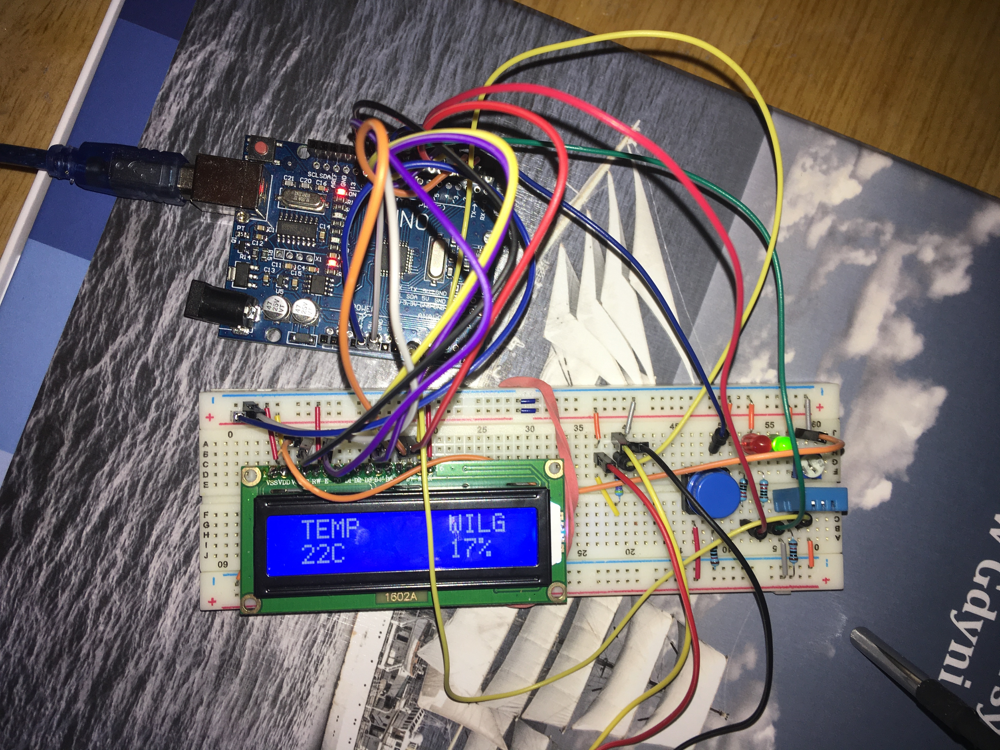
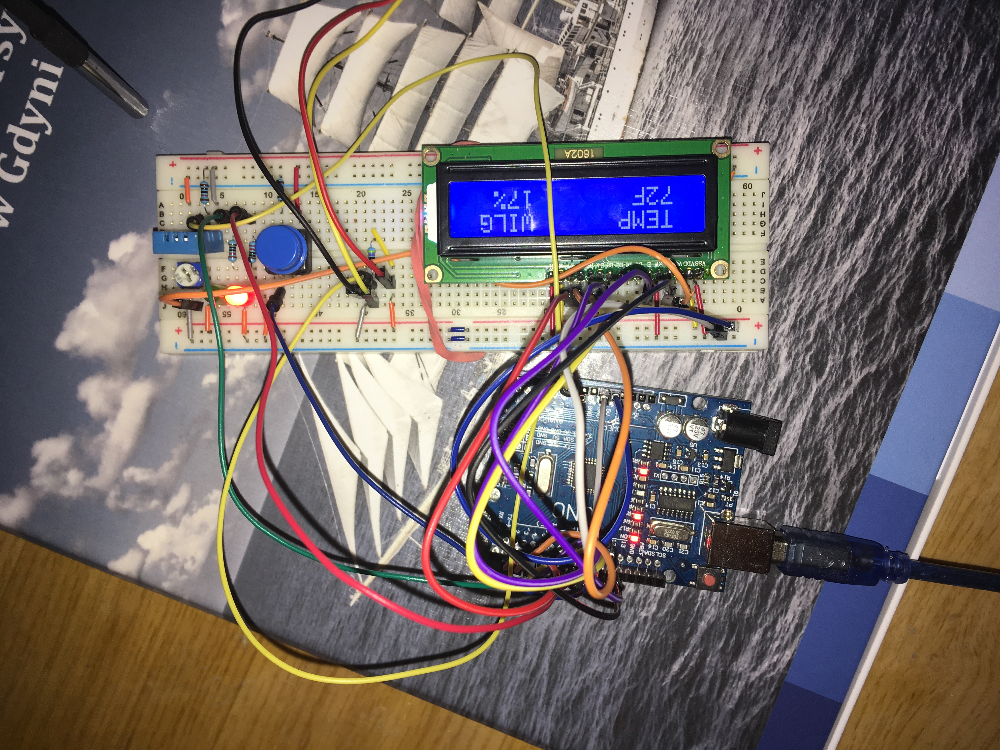

# Stacja pogodowa wyświetlająca temperaturę oraz wilgotność

## Ogólny opis
Elementy wejścia:
* Czujnik temperatury i wilgotności DHT11
* Czujnik temperatury DS18B20
* Przycisk

Elementy wyjścia:
* Wyświetlacz LCD

Wykorzystane bilbioteki:
* LiquidCrystal
* OneWire
* DallasTemperature
* DHT
* Adafruit_Sensor

Wykorzystane elementy:
*
*
*
*
*
*
*
*
*
*

Układ wyświetla na ekranie LCD temperaturę w Celsjuszach oraz Fahrenheitach pobieraną z czujnika DS18B20 oraz wilgotność powietrza pobieraną z czujnika DHT11.
Zastosowany przycisk pozwala wybrać czy chcemy wyświetlać temperaturę w Celsjuszach lub Fahrenheitach sygnalizując przy tym odpowiednią diodą LED (Zielona dla C, czerwona dla F).

## Opis Kodu
Wykorzystane zostały nastepujące biblioteki.
```cpp
#include <OneWire.h>                             // Biblioteka wykorzystana do poprawnego działania czujnika temperatury DS18B20
#include <DallasTemperature.h>                   // Biblioteka wykorzystana dla czujnika temperatury DS18B20
#include <LiquidCrystal.h>                       // Biblioteka wykorzystana do ekranu LCD
#include <Adafruit_Sensor.h>                     // Wymagana bilbioteka do poprawnego działania sensora DHT11
#include <DHT.h>                                 // Biblioteka wykorzystana dla czujnika DHT11
```
Następnie zadeklarowano zmienne oraz PINY dla poszczególnych elementów.
```cpp
#define DHT_PIN A0                                // PIN cyfrowy podlaczony do DHT11
#define DHTTYPE DHT11                             // Zdefiniowany typ DHT w tym przypadku DHT11
const int SENSOR_PIN = A1;                        // PIN cyfrowy podlaczony do DS18B20
const int buttonPin = 9;                          // PIN podlaczony do guzika
const int rledPin =  8;                           // PIN podlaczony do czerwonego LEDA
const int gledPin =  7;                           // PIN podlaczony do zielonego LEDA
int buttonState = 0;
int klik = 0;
int button = 0;
bool CF = true;
DHT dht = DHT(DHT_PIN ,DHTTYPE);
LiquidCrystal lcd(12, 11, 5, 4, 3, 2);            // Podlaczone PINY wyswietlacza LCD
OneWire oneWire(SENSOR_PIN);                      // Uruchamia biblioteke oneWire
DallasTemperature sensors(&oneWire);              // Przekazuje dane z biblioteki oneWire do bilbioteki DallasTemperature
```
W tej części kodu uruchomiono oba sensory, uruchomiono wyświetlacz, wypisano tekst na wyświetlaczu oraz zadeklarowano przycisk jako wejście natomiast dwie diody LED jako wyjście.
```cpp
void setup()
{
  pinMode(rledPin, OUTPUT);                       // Ustawienie czerwonego LEDA jako wyjście
  pinMode(gledPin, OUTPUT);                       // Ustawienie zielonego LEDA jako wyjście
  pinMode(buttonPin, INPUT_PULLUP);
  lcd.begin(16, 2);
  lcd.print(" TEMP      WILG");                   // Wyswietla napis
  Serial.begin(9600);
  sensors.begin();                                // Uruchamia sensor DS18B20
  dht.begin();                                    // Uruchamia sensor DHT11
}
```
Następnie przypisano zmienne dla wartości temperatur oraz wilgotności powietrza.
```cpp
void loop()
{
  float tempC;                                    // Temperatura w C
  float tempF;                                    // Temperature w F
  float humidity = dht.readHumidity(DHT_PIN);     // Wilgotnosc
```
W tej części program sprawdza czy czujnik DHT11 działa poprawnie. Jeżeli zwraca błąd program informuje nas o tym w Serial Monitorze. Jeśli działa poprawnie, program przechodzi dalej.
```cpp
  if (isnan(humidity))                            // Sprawdza blad odczytu z czujnika DHT11
    {
      Serial.println(F("Brak odczytu z DHT!"));   // Zwraca blad w Serial Monitorze
      return;                                     // Zapetla az blad ustanie
    }
```
  Program odczytuje stan guzika (wysoki lub niski) i wyświetla odpowiednio 0 lub 1 w Serial Monitorze. 
```cpp
  buttonState = digitalRead(buttonPin);           // Odczytanie stanu przycisku (HIGH lub LOW)
  
  Serial.print("  -  ");                          // Separator
  Serial.print("Stan przycisku:  ");              // Wyswietla napis
  Serial.println(buttonState);                    // Wypisuje stan przycisku w Serial Monitor
```
Stan guzika zostaje zapisany w zmiennej, następnie zostaje wyświetlona temperatura oraz dioda LED w zależności od stanu przycisku.
W tej części kod jest realizowany dla wartości Celsjusza.
```cpp
  button = buttonState;                           // Stan guzika w zmiennej
  if(klik==0 && button==1)
  {
  CF = !CF;
  }
  klik = button;
  
  if (CF)                                        // Wybór pomiędzy C lub F
    {

      digitalWrite(gledPin, HIGH);               // Zapala zielonego LEDA
      digitalWrite(rledPin, LOW);                // Gasi czerwonego LEDA
      
      sensors.requestTemperatures();             // Wysyła komende aby odczytac wartosc temperatury
      tempC = sensors.getTempCByIndex(0);        // Czyta wartosc temperatury w C

      Serial.print("Temperatura: ");             // Wyswietla napis
      Serial.print(tempC);                       // Wypisuje temperature w C
      Serial.print("°C");                        // Wyswietla napis
      Serial.print("  -  ");                     // Separator
      Serial.print("Wilgotnosc: ");              // Wyswietla napis
      Serial.print(humidity);                    // Wypisuje wilgotnosc w %
      Serial.print("%");                         // Wyswietla napis
  
      lcd.setCursor(1,3);                        
      lcd.print(round(tempC));                   // Wypisuje temperature w C
      lcd.print("C       ");                     // Wyswietla napis
      lcd.print(round(humidity));                // Wypisuje wilgotnosc w %
      lcd.print("%   ");                         // Wyswietla napis
    }
 ```
 Tutaj natomiast wyświetla wartości w Fahrenheitach. Dioda led pali się na czerwono.
 ```cpp
  else
    {   
      digitalWrite(gledPin, LOW);                // Gasi zielonego LEDA
      digitalWrite(rledPin, HIGH);               // Zapala czerwonego LEDA
      
      sensors.requestTemperatures();             // Wysyła komende aby odczytac wartosc temperatury
      tempC = sensors.getTempCByIndex(0);        // Czyta wartosc temperatury w C
      tempF = tempC * 9 / 5 + 32;                // Konwertuje wartosc temperatury z C na F

      Serial.print("Temperatura: ");             // Wyswietla napis
      Serial.print(tempF);                       // Wypisuje temperature w F
      Serial.println("°F");                      // Wyswietla napis
      Serial.print("  -  ");                     // Separator
      Serial.print("Wilgotnosc: ");              // Wyswietla napis
      Serial.print(humidity);                    // Wypisuje wilgotnosc w %
      Serial.print("%");                         // Wyswietla napis
  
      lcd.setCursor(1,3);                        
      lcd.print(round(tempF));                   // Wypisuje temperature w F
      lcd.print("F       ");                     // Wyswietla napis
      lcd.print(round(humidity));                // Wypisuje wilgotnosc w %
      lcd.print("%   ");                         // Wyswietla napis
   }
}
```
## Zdjęcia oraz film działającego programu.





Działanie guzika zobrazowane zostało na filmie.

[](https://youtu.be/bysFPIYge0k)
